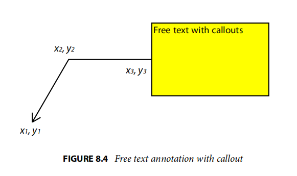

# 8.4.5.5 自由文本注释（Free Text Annotations）

\
一个自由的文本注释(PDF 1.3)直接在页面上显示文本。与普通的文本注释不同(参见621页的“Text Annotations”)，自由文本注释没有打开或关闭状态;文本总是可见的，而不是显示在弹出窗口中。表8.25给出了该注释类型对应的注释字典条目。第677页的“Variable Text”描述了使用这些条目在这些注释中生成文本外观的过程。

表8.25特定于自由文本注释的附加条目

| KEY     | TYPE                       | VALUE                                                                                                                                                                                                                     |
| ------- | -------------------------- | ------------------------------------------------------------------------------------------------------------------------------------------------------------------------------------------------------------------------- |
| Subtype | name                       | （必填）此字典所描述的注释类型；免费文本注释必须为自由文本。                                                                                                                                                                                            |
| DA      | string                     | 
（必填）用于文本格式化的默认外观字符串（请参阅第677页上的“变量文本”）。

   注：如果存在注释字典的AP条目，则优先于DA条目；请参见第606页的表8.15和第8.4.4节的“外观流”。
                                                                                                             |
| Q       | integer                    | 
（可选；PDF1.4）指定要用于显示注释文本的字幕（理由）形式的代码：

   0 左对齐的

   1 中心

   2 右对齐的 

   默认值：0（左对齐）。
                                                                                                            |
| RC      | text string or text stream | （可选；PDF1.5）用于生成注释外观的富文本字符串（请参见第680页上的“富文本字符串”）。                                                                                                                                                                           |
| DS      | text string                | （可选；PDF1.5）默认样式字符串，如第680页的“富文本字符串”中所述。                                                                                                                                                                                    |
| CL      | array                      | (可选；PDF1.6)由四个或六个数字组成的数组，指定附加到自由文本注释上的编号行。6个数字\[x1 y1 x2 y2 x3 y3]表示默认用户空间中直线的起点、膝盖点和终点坐标，如图8.4所示。四个数字\[x1 y1 x2 y2]表示直线的开始和结束坐标。                                                                                         |
| IT      | name                       | （可选；PDF1.6)描述自由文本注释意图的名称（另请参见表8.21）。有效的值是自由文本调用，这意味着注释旨在作为调用的功能，以及自由文本打字器，这意味着注释旨在作为单击类型或打字机对象。                                                                                                                           |
| BE      | dictionary                 | （可选；PDF1.6)与BS条目指定的边框样式字典一起使用的边框效果字典（请参见表8.18）。                                                                                                                                                                           |
| RD      | rectangle                  | (可选；PDF1.6)一组四个数字，描述了两个矩形之间的数字差异：注释的**Rect条目**和包含在该矩形中的一个矩形。内部矩形是应该显示注释的文本的位置。由BS和BE条目指定的任何边框样式和/或边框效果都分别应用于内部矩形的边框。这四个数字分别对应于**Rect**的左、上、右、下坐标与内部矩形坐标之间的默认用户空间的差异。每个值必须大于或等于0。顶部和底部差之和必须小于Rect的高度，左右差之和必须小于**Rect**的宽度。 |
| BS      | dictionary                 | （可选；PDF1.6)边框样式字典（参见第611页上的表8.17），指定要用于绘制标注边框的线宽和破折线模式。注：注释字典的AP条目如果存在，则优先于InkList和BS条目；请参见第606页的表8.15和第8.4.4节“外观流”。                                                                                                      |
| LE      | array                      | (可选；PDF1.6)由两个名称组成的数组，指定要用于绘制标注的边框的行结束样式。数组的第一和第二个元素分别指定由L数组中的第一对和第二对坐标（x1、y1）和（x2、y2）定义的端点的行结束样式。表8.27显示了可能的值。默认值                                                                                                        |

